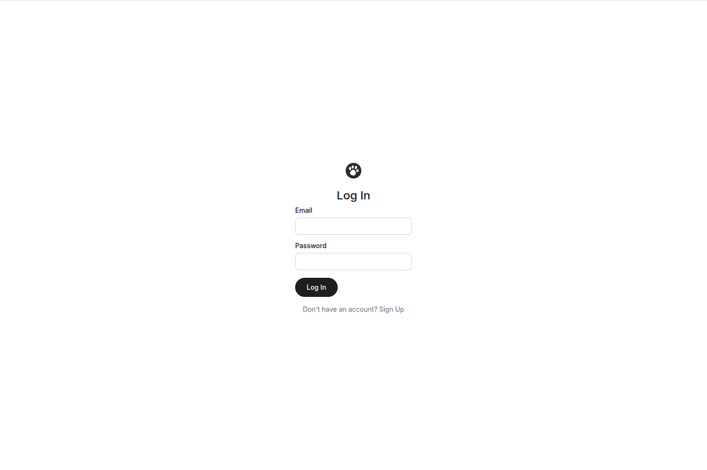
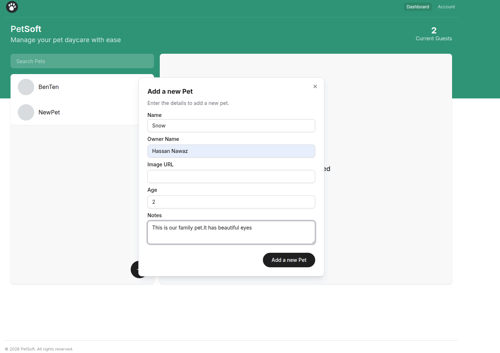
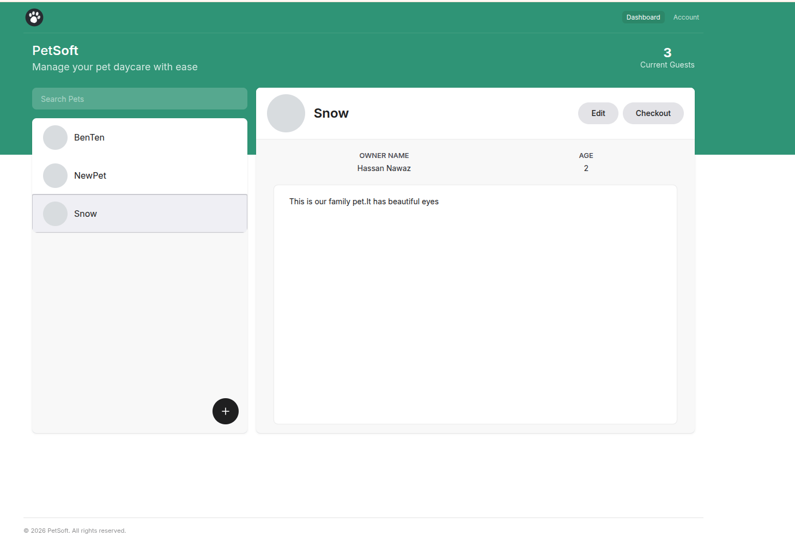
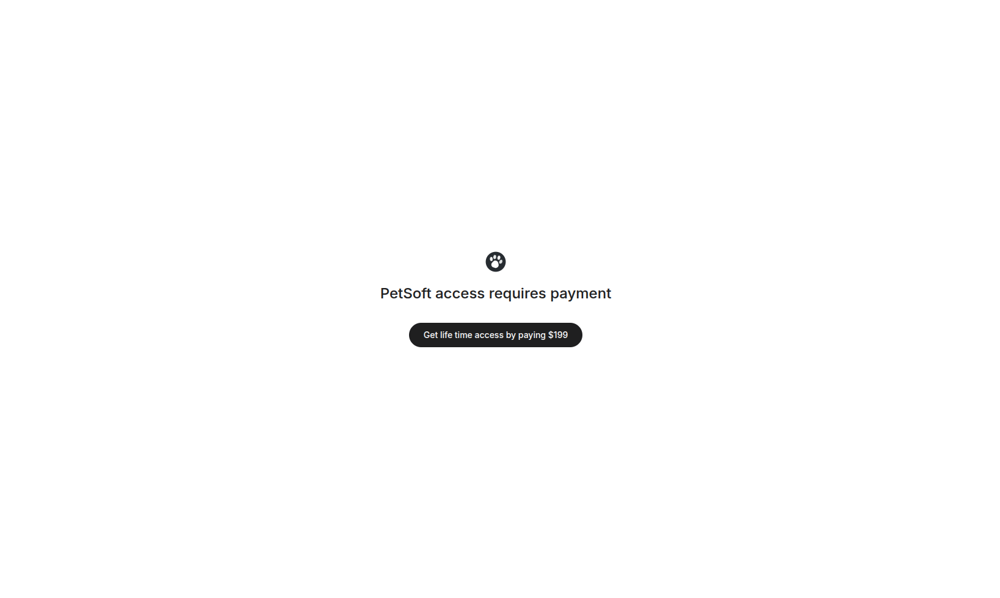
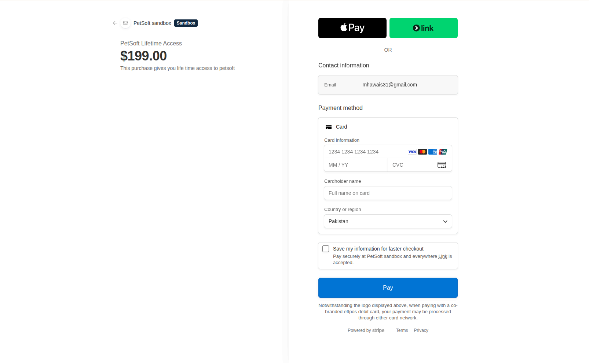

# 🐾 PetSoft

**PetSoft** is a modern **full-stack pet management platform** built with **Next.js 15 (App Router)**.  
It enables users to **track pets, manage their details, perform searches**, and **securely handle payments** for premium access.

The app leverages **Server Actions** for all CRUD operations, integrates **NextAuth v5 (Credentials Provider)** for authentication, and uses **Stripe** for secure payment processing — all wrapped in a **clean, responsive, and optimized UI** built with **shadcn/ui** and **TailwindCSS**.

**Live demo:** [pet-soft-beige.vercel.app](https://pet-soft-beige.vercel.app/)

## 📸 Screenshots








## ✨ Features

### 🔐 Authentication & Authorization
- Secure **signup and signin** with **NextAuth v5 (Credentials Provider)**.  
- **JWT & Session callbacks** handle custom fields (`id`, `hasAccess`).  
- Protected routes using **middleware** and **layout-based authorization**.  
- Two-layer authentication setup:
  - `auth-no-edge.ts` → Full version for API routes & server actions.  
  - `auth-edge.ts` → Lightweight version for middleware (reduces bundle size).

### 🐕 Pet Management (CRUD)
- Full CRUD with **Server Actions** — no client-side mutation exposure.  
- Manage multiple pets with **add/edit notes** and **search filters**.  
- Real-time search using **Context API** and dynamic filters.  
- **Optimistic UI** updates via `useOptimistic`.

### 💳 Stripe Payments
- Stripe integration to unlock premium app features.  
- Secure webhook validation using `stripe.webhooks.constructEvent`.  
- Auto-update of user’s access (`hasAccess = true`) post-payment.  
- End-to-end flow: **Checkout → Webhook → DB Update → JWT Refresh**.

### 🎨 Modern UI / UX
- **shadcn/ui** components + **TailwindCSS** design system.  
- **Sonner** for toast notifications.  
- Custom components: `Header`, `Footer`, `PetList`, `PetDetails`, `PaymentAccessButton`, etc.  
- Responsive layout with smooth transitions and feedback.

## 🧠 State Management & Optimization

| Concept | Purpose |
|----------|----------|
| **PetContext** | Stores pet list, loading state, CRUD helpers, and optimistic updates. |
| **SearchContext** | Manages search query & filtered pets. |
| **useOptimistic** | Instant UI response before confirmation. |
| **useTransition** | Keeps UI responsive during async work. |
| **useActionState** | Simplifies form action handling and loading UI. |


## 🧪 Validation & Forms

- **react-hook-form** for lightweight form management.  
- **Zod** schemas define validation + infer types automatically.  
- Validation errors are displayed inline using shadcn components.


## 🧩 Tech Stack

| Category | Technology |
|-----------|-------------|
| Framework | Next.js 15 (App Router) |
| Language | TypeScript |
| UI Library | shadcn/ui + TailwindCSS |
| State Management | Context API, `useTransition`, `useActionState` |
| Form Handling | React Hook Form |
| Validation | Zod |
| Authentication | NextAuth v5 (Credentials Provider) |
| Database | Prisma ORM |
| Payment | Stripe |
| Notifications | Sonner |


## 🗂️ Project Structure

```
src/
 ├── app/
 │   ├── (auth)/              # Public routes (login, signup, payment)
 │   ├── (home)/              # Public homepage
 │   ├── (app)/               # Authenticated routes
 │   │   ├── dashboard/
 │   │   ├── account/
 │   │   └── layout.tsx
 │   ├── api/
 │   │   ├── stripe/          # Stripe webhook validation
 │   │   └── auth/[...nextauth]/route.ts
 │   └── layout.tsx
 │
 ├── components/
 │   ├── ui/                  # shadcn/ui components
 │   └── custom/              # Header, Footer, PetList, PetDetails, etc.
 │
 ├── contexts/                # Context providers (PetContext, SearchContext)
 ├── actions/                 # Server actions (addPet, editPet, etc.)
 ├── libs/                    
 │   ├── auth-no-edge.ts      # Full NextAuth config (API, server actions)
 │   ├── auth-edge.ts         # Lightweight auth (used in middleware)
 │   ├── prisma.ts            # Prisma client instance
 │   ├── schema.ts            # Zod schemas
 │   ├── types.ts             # Global types
 │   ├── constants.ts         # Shared constants
 │   └── next.types.d.ts      # Extended JWT & Session types
 │
 ├── styles/                  # Global styles
 └── middleware.ts            # Route protection middleware
```

## 🚀 Getting Started

### 1️⃣ Clone the Repo
```bash
git clone https://github.com/awais1019/petsoft.git
cd petsoft
```

### 2️⃣ Install Dependencies
```bash
npm install
```

### 3️⃣ Setup Environment
Create `.env` with:
```bash
DATABASE_URL=
NEXTAUTH_SECRET=
NEXTAUTH_URL=http://localhost:3000
STRIPE_SECRET_KEY=
STRIPE_PUBLISHABLE_KEY=
STRIPE_WEBHOOK_SECRET=
STRIPE_PRICE_ID=
```

### 4️⃣ Prisma Setup
```bash
npx prisma generate
npx prisma db push
```

### 5️⃣ Run the App
```bash
npm run dev
```

## 🔐 Authentication Flow (NextAuth v5)

**NextAuth v5** uses a custom **Credentials Provider**:

1. **Signup / Signin** → handled in `authorize()` using email/password.  
2. **JWT Callback** → adds `id` and `hasAccess` to the token.  
3. **Session Callback** → maps those fields to the client session.  
4. **Two Versions of Auth:**
   - `auth-no-edge.ts` – Full, used in server actions & API.
   - `auth-edge.ts` – Lightweight, used only in middleware (avoids size limit).

**Why this split?**  
Vercel imposes a 1MB middleware limit — this approach keeps middleware fast and small.


## 💳 Stripe Payment Flow

**1. Setup Stripe**
- Create product, price, and keys in Stripe dashboard.  
- Add to `.env.local`:
  ```bash
  STRIPE_SECRET_KEY=
  STRIPE_PUBLISHABLE_KEY=
  STRIPE_WEBHOOK_SECRET=
  STRIPE_PRICE_ID=
  ```

**2. Checkout Session**
- Server-side action creates a checkout session:
  - Includes userId in metadata.
  - Redirects user to Stripe checkout page.

**3. Webhook Handling**
- Stripe calls `/api/stripe` after successful payment.
- Webhook validates signature and updates DB:
  ```ts
  user.hasAccess = true;
  ```

**4. Session Refresh**
- NextAuth JWT & session callbacks reflect updated `hasAccess`.  
- Client UI re-renders automatically with new access level.

### 🧪 Testing Payments Locally

Stripe **test mode** (active whenever you use your `sk_test_...` / `pk_test_...` keys) accepts special card numbers instead of real cards, so you can generate fake transaction history without moving real money:

| Card number | Result |
|---|---|
| `4242 4242 4242 4242` | Payment succeeds |
| `4000 0000 0000 0002` | Card declined |
| `4000 0025 0000 3155` | Requires 3D Secure authentication |

For any test card, use:
- **Expiry** — any future date (e.g. `12/34`)
- **CVC** — any 3 digits (e.g. `123`)
- **ZIP** — any 5 digits (e.g. `12345`)

Each successful test-mode checkout shows up in the Stripe Dashboard (with **Test mode** toggled on) under **Payments**, so repeating checkout with `4242 4242 4242 4242` a few times is an easy way to populate `hasAccess` transitions and Stripe's own dashboard with sample transaction history for demos/screenshots. See [Stripe's testing docs](https://stripe.com/docs/testing) for the full list of test cards. Test-mode payments never touch real card networks — this only works with test-mode keys.


## 📦 Deployment Notes

### ⚠️ Middleware Size Limit
**Problem:** `middleware.ts` exceeded 1MB on Vercel.  
**Fix:** Split auth logic into:
- `auth-edge.ts` → lightweight for middleware.  
- `auth-no-edge.ts` → heavy version for server actions.

### ⚙️ Prisma Client Initialization Error
**Previous Cause:** Prisma binaries were missing during the production build, causing client initialization to fail.

**Fix Implemented:**  
Added the **Prisma Webpack Plugin** to the Next.js build configuration.  
This plugin automatically includes the required Prisma binaries during the build process.

✅ **Result:** Prisma Client now initializes correctly in production without manual `npx prisma generate` or binary errors.


## 🧾 Lessons Learned

- Implemented **NextAuth v5 Credentials Provider** with JWT/session callbacks.  
- Built a **secure Stripe payment flow** with webhook validation.  
- Designed a **modular Next.js structure** using grouped routes & layouts.  
- Applied **Zod + react-hook-form** for type-safe validation.  
- Used **Server Actions** for secure CRUD and improved DX.  
- Implemented **Optimistic UI** and managed async UX with `useTransition`.  
- Solved **deployment challenges** (middleware bundle & Prisma binaries).  
- Understood the **token lifecycle** — creation, update, and client sync.  
- Applied **security best practices** (env isolation, webhook validation, idempotency).


